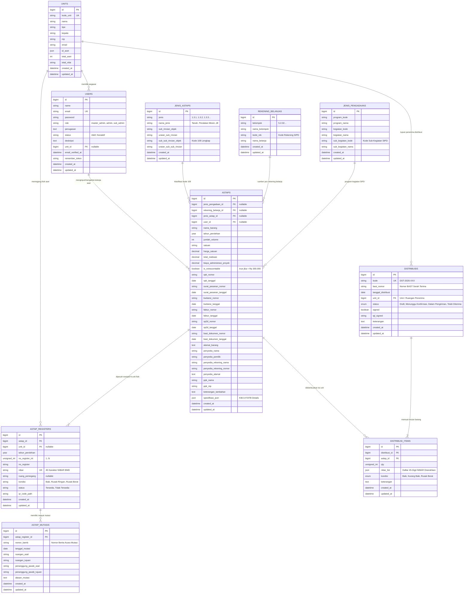

# Dokumen Analisis Database & ERD SIMAT-RK
**Sistem Informasi Manajemen Aset Tetap RSUD dr. H. Koesnandi Bondowoso**

> 🖼️ **Versi Gambar Vektor (SVG Beresolusi Tinggi):**
> Anda dapat melihat dan membuka langsung file gambar ERD di:
> - **[analiserd.svg](file:///d:/MAGANG%20RSUKOESNADI/SIMAT/analiserd.svg)** *(Root Project)*
> - **[public/analiserd.svg](file:///d:/MAGANG%20RSUKOESNADI/SIMAT/public/analiserd.svg)** *(Web Assets)*

---

## 1. Diagram ERD (Entity Relationship Diagram)



---

## 2. Struktur Modul & Kamus Data

### A. Modul Pengguna & Unit Kerja
1. **`units`**
   - Menyimpan seluruh data paviliun, instalasi, dan poli RSUD Dr. H. Koesnandi.
   - Atribut kunci: `kode_unit`, `nama`, `tipe`, `kepala`, `nip`.
2. **`users`**
   - Mengelola akun sistem dengan multi-level hak akses (`master_admin`, `admin`, `sub_admin`).
   - Setiap `sub_admin` terafiliasi dengan satu `unit_id`.

### B. Modul Klasifikasi Standar & Penganggaran SIPD
3. **`jenis_astaps`**
   - Klasifikasi Kode 108 BMD Permendagri (15.000+ data referensi).
   - Menentukan kategori KIB A s/d F dan ATB.
4. **`jenis_pengadaans`**
   - Data hierarki SIPD: Program $\rightarrow$ Kegiatan $\rightarrow$ Sub-Kegiatan.
5. **`rekening_belanjas`**
   - Akun kode belanja modal SIPD Pemkab Bondowoso.

### C. Modul Inti Katalog & Register Fisik (NIBAR)
6. **`astaps`**
   - Induk transaksi pengadaan belanja barang.
   - Menyimpan histori SPK, Kwitansi, SP2D, Faktur, BAST Rekanan, PPK, Penyedia.
   - `is_extracomtable`: Menandai barang bernilai $< \text{Rp } 300.000$.
   - `spesifikasi_json`: Menyimpan field dinamis spesifikasi KIB A-F/ATB.
7. **`astap_registers`**
   - Fisik per item barang bernomor **NIBAR 45 Karakter Unik**.
   - Terkoneksi dengan QR Code untuk audit ruangan dan scan publik.
8. **`astap_mutasis`**
   - Histori perpindahan aset antar ruangan (BAMB, ruangan asal, ruangan tujuan).

### D. Modul Distribusi & Serah Terima Internal
9. **`distribusis`**
   - Surat pengiriman/distribusi dan BAST internal ke unit ruangan penerima.
10. **`distribusi_items`**
    - Item detail aset yang diserahkan beserta array list NIBAR yang ditransfer.

---

## 3. Matriks Relasi Antar Tabel

| Tabel Parent | Tabel Child | Foreign Key | Tipe Relasi | Action On Delete |
| :--- | :--- | :--- | :---: | :--- |
| `units` | `users` | `users.unit_id` | **1 : N** | `SET NULL` |
| `units` | `astap_registers` | `astap_registers.unit_id` | **1 : N** | `SET NULL` |
| `units` | `distribusis` | `distribusis.unit_id` | **1 : N** | `CASCADE` |
| `jenis_astaps` | `astaps` | `astaps.jenis_astap_id` | **1 : N** | `SET NULL` |
| `jenis_pengadaans` | `astaps` | `astaps.jenis_pengadaan_id` | **1 : N** | `SET NULL` |
| `rekening_belanjas` | `astaps` | `astaps.rekening_belanja_id` | **1 : N** | `SET NULL` |
| `users` | `astaps` | `astaps.user_id` | **1 : N** | `SET NULL` |
| `astaps` | `astap_registers` | `astap_registers.astap_id` | **1 : N** | `CASCADE` |
| `astap_registers` | `astap_mutasis` | `astap_mutasis.astap_register_id` | **1 : N** | `CASCADE` |
| `distribusis` | `distribusi_items` | `distribusi_items.distribusi_id` | **1 : N** | `CASCADE` |
| `astaps` | `distribusi_items` | `distribusi_items.astap_id` | **1 : N** | `CASCADE` |

---

## 4. Format NIBAR 45 Digit

```
[12013511] [0200000028] [00002026] [132050206001] [0000001]
│          │            │          │              └── No Register Urut (7 digit)
│          │            │          └───────────────── Kode 108 BMD (12 digit)
│          │            └──────────────────────────── Tahun Perolehan (8 digit)
│          └───────────────────────────────────────── Kode Lokasi RSUD (10 digit)
└──────────────────────────────────────────────────── Kode Wilayah Pemkab (8 digit)
```
